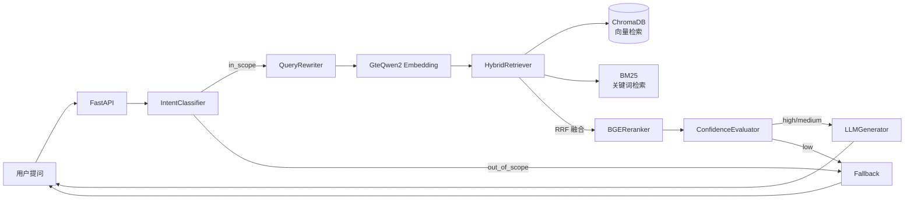
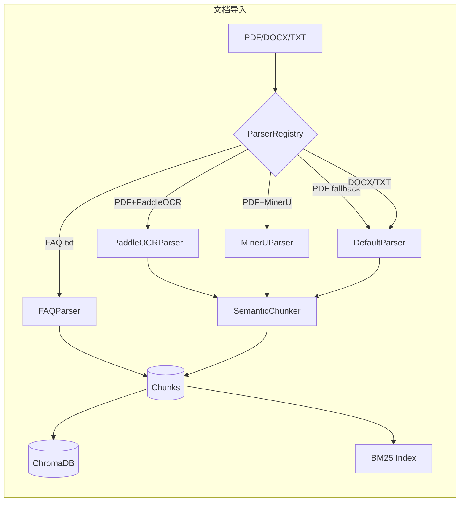

# AI 客服系统

企业级 RAG 知识库客服系统。RAG 全链路手搓，Ports & Adapters 架构，可独立部署或作为组件接入。

## 系统架构





## 文档导航

### 技术文档（代码同步更新）

| 文档 | 内容 |
|------|------|
| [docs/architecture.md](./docs/architecture.md) | 系统分层架构图、Ports & Adapters 对照表 |
| [docs/rag-query-flow.md](./docs/rag-query-flow.md) | RAG 七步查询流程、置信度三路信号、SSE 时序图、RRF 算法 |
| [docs/data-model.md](./docs/data-model.md) | ER 图、ChromaDB 元数据约定、sources 格式、trace_id 日志 |
| [docs/llm-guide.md](./docs/llm-guide.md) | LLM 配置指南：LiteLLM 机制、模型切换、Fallback、成本优化 |
| [docs/ingestion-guide.md](./docs/ingestion-guide.md) | 知识库构建：解析文档、写入向量库、BM25 索引、数据结构说明 |
| [CHANGELOG.md](./CHANGELOG.md) | 版本迭代记录：每个版本新增内容、修复项 |

### 产品与设计文档

| 文档 | 用途 | 适合读者 |
|------|------|---------|
| [phase1-product-spec.md](./phase1-product-spec.md) | **产品规格**：功能清单、API契约、安全模型、里程碑 | 快速了解做了什么 |
| [architecture-design-principles.md](./architecture-design-principles.md) | **架构设计**：Ports & Adapters、组件化地图、RAG链路、置信度设计 | 理解怎么设计的 |
| [tech-selection.md](./tech-selection.md) | **技术选型**：各组件对比表、决策依据 | 理解为什么这样选 |
| [test-validation-plan.md](./test-validation-plan.md) | **测试方案**：测试集设计、评估指标、可观测性架构 | 了解质量保障 |
| [interview-prep.md](./interview-prep.md) | **面试素材**：30s pitch、技术深度展示、高频问题标准答法 | 面试准备 |

## 推荐阅读顺序

1. `docs/architecture.md` — 系统分层架构全景
2. `docs/rag-query-flow.md` — RAG 核心链路详解
3. `docs/llm-guide.md` — LLM 配置与使用
4. `phase1-product-spec.md` — 了解整体产品范围

---

## 快速开始

### 1. 环境准备

```bash
# 克隆项目
git clone https://github.com/bob798/rag-customer-service.git
cd rag-customer-service

# 安装依赖（需要 Python 3.12，PyTorch 暂无 Python 3.13 的 macOS x86_64 wheel）
python3.12 -m venv .venv && source .venv/bin/activate
pip install -r requirements.txt

# 配置 LLM API Key（三选一）
cp .env.example .env
# 编辑 .env，填入 ANTHROPIC_API_KEY 或 OPENAI_API_KEY 或 DEEPSEEK_API_KEY
```

> **模型配置详情**见 [docs/llm-guide.md](./docs/llm-guide.md)

### 2. 验证配置（无需下载 Embedding 模型）

```bash
# 用 mock 模式跑完整 RAG 链路（零依赖，立即可用）
.venv/bin/python scripts/demo_pipeline.py
```

**输出示例**：

```
📚 正在构建知识库 (mock 模式)...
  已导入 5 条 FAQ

============================================================
❓ 问题: 怎么申请退款？
💬 回答: 退款申请：在订单详情页点击"申请退款"，填写原因提交即可。
   📄 来源: 常见问题FAQ.txt | 退款流程：在订单详情页点击...
   🎯 置信度: 0.85

============================================================
❓ 问题: 帮我写一首诗
💬 回答: 这个问题超出了我的服务范围，请联系人工客服。
   🎯 置信度: 0.00   ← out_of_scope fallback 正常触发
```

设置真实 API Key 后，脚本自动切换到真实 LLM 模式：

```bash
export ANTHROPIC_API_KEY=sk-ant-...
.venv/bin/python scripts/demo_pipeline.py
# 使用 claude-haiku-4-5-20251001，返回真实 AI 回答
```

脚本会验证以下链路节点：意图识别 → Query 改写 → 向量检索+BM25检索+RRF融合 → 置信度评估 → LLM 生成 → sources 溯源 → out_of_scope fallback。

### 3. 构建知识库

```bash
# 预览解析结果（不写入，快速验证格式）
.venv/bin/python scripts/ingest.py docs/samples/faq_example.txt --dry-run

# 正式导入（首次会下载 GteQwen2 embedding 模型，约 3GB）
.venv/bin/python scripts/ingest.py docs/samples/faq_example.txt

# 批量导入整个目录
.venv/bin/python scripts/ingest.py data/docs/
```

支持格式：`.txt`（FAQ 格式自动识别）、`.pdf`、`.docx`

> **完整说明**见 [docs/ingestion-guide.md](./docs/ingestion-guide.md)

**当前解析能力**：

| 内容类型 | 支持情况 |
|---------|---------|
| 纯文字（段落文本） | ✅ 正常，按段落 + 中文句终符分块 |
| FAQ 格式（Q:/A: 或 问：/答：） | ✅ 每对问答一个 chunk，检索精度最高 |
| 中文分块 | ✅ 字符计数，中文标点句终符切分，overlap 正常 |
| 表格（PDF/DOCX） | ⚠️ DefaultParser 拉平为文本；MinerU 安装后保留 HTML 结构 |
| 图片/扫描件 | ⚠️ DefaultParser 不支持；MinerU 安装后支持 OCR + 图片提取 |
| MinerU 高质量解析 | ✅ 代码就绪，安装 MinerU 后自动启用（需 Docker/Linux，本机 torch 限制） |

多模态升级路线图见 [docs/research/multimodal-document-parsing.md](./docs/research/multimodal-document-parsing.md)。

### 4. 启动 API 服务

```bash
# 开发模式（热重载）
ADMIN_API_KEY=your-admin-key WIDGET_TOKEN_SECRET=your-widget-token \
  .venv/bin/uvicorn api.main:app --reload --port 8000

# 验证服务
curl http://localhost:8000/health
# {"status":"ok","vector_db":"ok","llm":"unknown"}
```

**主要接口**：

| 接口 | 认证 | 说明 |
|------|------|------|
| `POST /chat` | Widget Token | 提问，支持 SSE 流式和非流式 |
| `POST /knowledge/upload` | Admin Key | 上传文档（后台异步索引） |
| `POST /knowledge/qa` | Admin Key | 写入 Q&A 条目 |
| `GET  /knowledge/documents` | Admin Key | 列出所有文档 |
| `GET  /sessions` | Admin Key | 列出会话历史 |
| `GET  /config` | Admin Key | 读取系统配置 |
| `PUT  /config` | Admin Key | 更新配置项 |
| `GET  /health` | 无 | 组件健康状态 |
| `GET  /docs` | 无 | Swagger UI |

**示例请求**：

```bash
# 上传知识库文档
curl -X POST http://localhost:8000/knowledge/upload \
  -H "x-api-key: your-admin-key" \
  -F "file=@docs/samples/faq_example.txt"

# 提问（非流式）
curl -X POST http://localhost:8000/chat \
  -H "x-widget-token: your-widget-token" \
  -H "Content-Type: application/json" \
  -d '{"question": "退款需要多久", "session_id": "s1", "stream": false}'
```

---

## 测试

### 测试结构

```
tests/
├── core/                 165 用例  单元测试（全 mock，最快）
├── integration/           78 用例  集成测试（DeterministicEmbedder + NoopReranker）
├── smoke/                  6 用例  冒烟测试（真实 jieba/BM25）
├── api/                   19 用例  API 接口测试
└── data/                           测试数据 + Golden data + QA 评测集

scripts/
└── eval_production_pipeline.py     E2E 质量评测（真实模型 + 真实 LLM API）
```

| 层级 | 位置 | Embedder | Reranker | LLM | CI | 用途 |
|------|------|----------|----------|-----|-----|------|
| 单元测试 | `tests/core/` | mock | mock | mock | ✅ | 验证每个函数逻辑 |
| 集成测试 | `tests/integration/` | Deterministic | Noop | mock | ✅ | 验证组件协作、回归 |
| 冒烟测试 | `tests/smoke/` | 无 | 无 | 无 | ✅ | 真实依赖不崩溃 |
| E2E 评测 | `scripts/eval_*.py` | **GteQwen2** | **BGEReranker** | **真实 API** | ❌ | 检索质量 |

### 运行命令

```bash
# CI 自动化（每次提交）
.venv/bin/pytest tests/core/ tests/integration/ -q --no-cov

# 全量 + 覆盖率
.venv/bin/pytest

# E2E 质量评测（手动，需模型 + API key）
.venv/bin/python scripts/eval_production_pipeline.py
```

当前状态：**284 passed，覆盖率 91%**

### 测试报告

```bash
open test-reports/report.html          # 用例 pass/fail 详情
open test-reports/coverage/index.html  # 覆盖率（点击行号可溯源到测试）
```

> 详细测试规范见 [CLAUDE.md](./CLAUDE.md) "测试规范" 章节，E2E 评测结果见 `tests/data/qa_eval_results_v*.json`

---

## 技术栈

- **核心**：Python 3.12 + FastAPI + RAG 全链路手搓
- **检索**：ChromaDB（向量）+ rank_bm25（关键词）+ RRF 融合
- **Embedding**：gte-Qwen2-1.5B（本地，中文 MTEB ~70）
- **Reranker**：BGE-Reranker-v2-m3（本地，零 API 成本）
- **LLM**：Claude / DeepSeek / 通义（LiteLLM 统一接口，见 [docs/llm-guide.md](./docs/llm-guide.md)）
- **部署**：Docker Compose

## 项目状态

- **v0.1.0**（2026-04）Phase 1：RAG 核心链路 + 基础组件
- **v0.2.0**（2026-04）Week 2：完整 API 层（/chat SSE + 知识库管理 + 会话历史 + 配置）
- **v0.3.0-dev**（2026-04）中文分块修复 + MinerU Parser + 回归测试体系，284 tests

完整版本记录见 [CHANGELOG.md](./CHANGELOG.md)

---

## 开发方式：AI 协作编程

本项目采用 **人机协作编程（Human-AI Collaborative Programming）** 模式开发。

### 工作流程

```
开发者碰撞产品需求
    ↓
根据需求制定技术方案 + 架构设计
    ↓
编写实施计划（Claude Code Plan Mode）
    ↓
Subagent 驱动执行（自动 TDD + 双轮代码审查）
    ↓
开发者审核合并
```

### 使用的工具

- **Claude Code**：主 AI 编程助手（claude.ai/code）
- **[Superpowers Skills](https://github.com/obra/superpowers)**：Claude Code 技能扩展套件
  - `subagent-driven-development`：每个任务派发独立 subagent 实现，实现后自动规格合规 + 代码质量双轮审查
  - `writing-plans`：结构化实施计划制定
  - `test-driven-development`：TDD 纪律执行
  - `using-git-worktrees`：git worktree 隔离工作空间

### 分工原则

| 开发者负责 | AI 负责 |
|-----------|---------|
| 产品需求定义 | 代码生成与实现 |
| 架构设计决策 | 规格合规审查 |
| 技术选型判断 | 代码质量审查 |
| 计划审批 | TDD 执行 |
| 最终代码审核 | 测试编写 |
