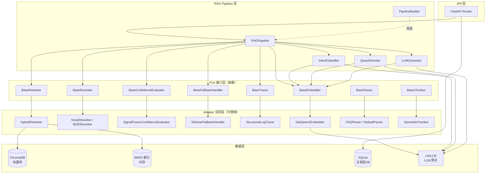

# 系统架构

## 分层架构图

## Ports & Adapters 对照表

| Port 接口 | 职责 | 默认 Adapter | 可替换为 |
|-----------|------|-------------|---------|
| `BaseRetriever` | 混合检索（向量 + BM25） | `HybridRetriever` | 纯向量检索、ES 检索 |
| `BaseReranker` | 候选重排序 | `NoopReranker`（测试）/ `BGEReranker`（生产） | 其他 CrossEncoder 模型 |
| `BaseConfidenceEvaluator` | 三路信号置信度评估 | `SignalFusionConfidenceEvaluator` | 基于阈值的简单评估 |
| `BaseFallbackHandler` | 低置信度/越界兜底 | `TellUserFallbackHandler` | 转人工、FAQ 搜索 |
| `BaseTracer` | 链路追踪日志 | `StructuredLogTracer` | OpenTelemetry、Jaeger |
| `BaseEmbedder` | 文本向量化 | `GteQwen2Embedder` | OpenAI Embedding、BGE |
| `BaseParser` | 文档解析为原始文本 | `FAQParser`、`DefaultParser` | PDF专用、OCR解析 |
| `BaseChunker` | 文本分块 | `SemanticChunker` | 按段落、按Token |

## 核心设计原则

1. **Ports & Adapters（六边形架构）**：所有外部依赖通过接口抽象，业务逻辑不依赖具体实现
2. **依赖注入**：`RAGPipeline` 通过构造函数注入所有组件，`PipelineBuilder` 负责组装
3. **Pipeline 不依赖 DB**：`session_history` 由 API 层查询后传入，pipeline 保持无状态
4. **同步 + 异步分离**：`ConfidenceEvaluator.evaluate()` 为同步（纯计算），其余 I/O 操作为 async
