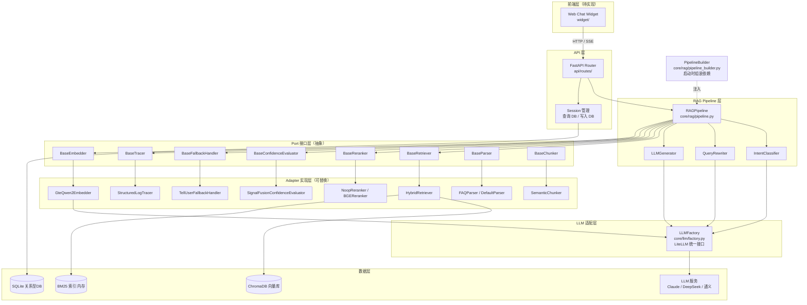

# 系统架构

## 分层架构图

> `PipelineBuilder` 仅在服务启动时运行，负责将所有组件组装注入到 `RAGPipeline`，不在请求链路上。

---

## 前端说明

| 目录 | 状态 | 说明 |
|------|------|------|
| `widget/` | 待实现（Week 2） | 嵌入式客服聊天 Widget，纯 JS/HTML，零依赖 |

预期功能：
- 悬浮按钮 + 对话气泡窗口
- 流式打字机效果（对接 SSE 接口）
- 历史消息展示
- 置信度低时显示"仅供参考"标识

API 接口（后端已实现占位，待连接）：
- `POST /api/v1/chat` — 非流式问答
- `POST /api/v1/chat/stream` — SSE 流式问答

---

## Ports & Adapters 对照表

| Port 接口 | 职责 | 默认 Adapter | 可替换为 |
|-----------|------|-------------|---------|
| `BaseRetriever` | 混合检索（向量 + BM25） | `HybridRetriever` | 纯向量检索、ES 检索 |
| `BaseReranker` | 候选重排序 | `NoopReranker`（测试）/ `BGEReranker`（生产） | 其他 CrossEncoder 模型 |
| `BaseConfidenceEvaluator` | 三路信号置信度评估 | `SignalFusionConfidenceEvaluator` | 基于阈值的简单评估 |
| `BaseFallbackHandler` | 低置信度/越界兜底 | `TellUserFallbackHandler` | 转人工、FAQ 搜索 |
| `BaseTracer` | 链路追踪日志 | `StructuredLogTracer` | OpenTelemetry、Jaeger |
| `BaseEmbedder` | 文本向量化 | `GteQwen2Embedder` | OpenAI Embedding、BGE |
| `BaseParser` | 文档解析为原始文本 | `FAQParser`、`DefaultParser` | PDF专用、OCR解析 |
| `BaseChunker` | 文本分块 | `SemanticChunker` | 按段落、按Token |

---

## 核心设计原则

1. **Ports & Adapters（六边形架构）**：所有外部依赖通过接口抽象，业务逻辑不依赖具体实现
2. **依赖注入**：`RAGPipeline` 通过构造函数注入所有组件，`PipelineBuilder` 负责启动时组装
3. **Pipeline 不依赖 DB**：`session_history` 由 API 层查询后传入，pipeline 保持无状态
4. **同步 + 异步分离**：`ConfidenceEvaluator.evaluate()` 为同步（纯计算），其余 I/O 操作为 async
5. **LLM 统一网关**：`LLMFactory` 封装 LiteLLM，所有 LLM 调用（意图/改写/生成）走同一接口，支持 fallback
