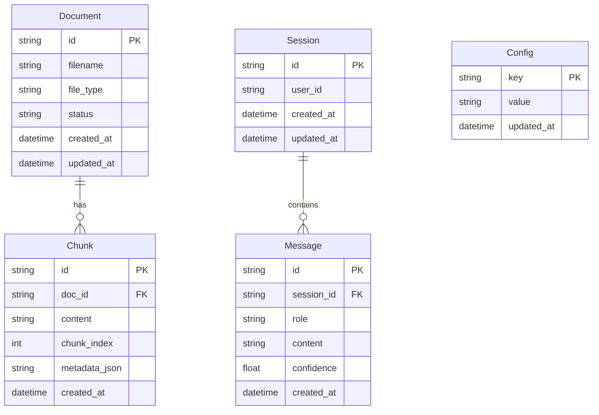

# 数据模型

## ER 图



## 关键字段说明

### Document
| 字段 | 说明 |
|------|------|
| `filename` | 原始文件名，同步到 ChromaDB 的 `source_title` 字段 |
| `file_type` | `pdf` / `docx` / `txt` / `faq` |
| `status` | `pending` / `processing` / `done` / `error` |

### Chunk
| 字段 | 说明 |
|------|------|
| `metadata_json` | JSON 字符串，包含 `source_title`、`type`（faq/text）等 |

### Message
| 字段 | 说明 |
|------|------|
| `role` | `user` / `assistant` |
| `confidence` | 该轮回答的置信度分数（仅 assistant 消息） |

## ChromaDB 元数据约定

向量库中每个 chunk 存储以下元数据（必须包含 `source_title`，用于 sources 格式）：

```json
{
  "doc_id": "uuid-string",
  "source_title": "FAQ帮助中心.txt",
  "type": "faq",
  "chunk_index": 0
}
```

## sources 响应格式

API 返回的 `sources` 字段格式：

```json
[
  {
    "doc_id": "550e8400-e29b-41d4-a716-446655440000",
    "chunk_id": "7c9e6679-7425-40de-944b-e07fc1f90ae7",
    "title": "FAQ帮助中心.txt",
    "content_preview": "退款申请流程：首先登录您的账户，进入订单页面..."
  }
]
```

## trace_id 全链路日志示例

每次请求生成唯一 `trace_id`，所有步骤日志关联到同一 ID：

```json
{"event": "trace_start", "trace_id": "a1b2c3d4-..."}
{"event": "step", "trace_id": "a1b2c3d4-...", "step": "intent", "data": {"result": "in_scope"}}
{"event": "step", "trace_id": "a1b2c3d4-...", "step": "rewrite", "data": {"rewritten": "如何申请退款"}}
{"event": "step", "trace_id": "a1b2c3d4-...", "step": "retrieve", "data": {"count": 20}}
{"event": "step", "trace_id": "a1b2c3d4-...", "step": "rerank", "data": {"count": 5}}
{"event": "step", "trace_id": "a1b2c3d4-...", "step": "confidence", "data": {"score": 0.82, "tier": "high"}}
{"event": "trace_end", "trace_id": "a1b2c3d4-..."}
```
