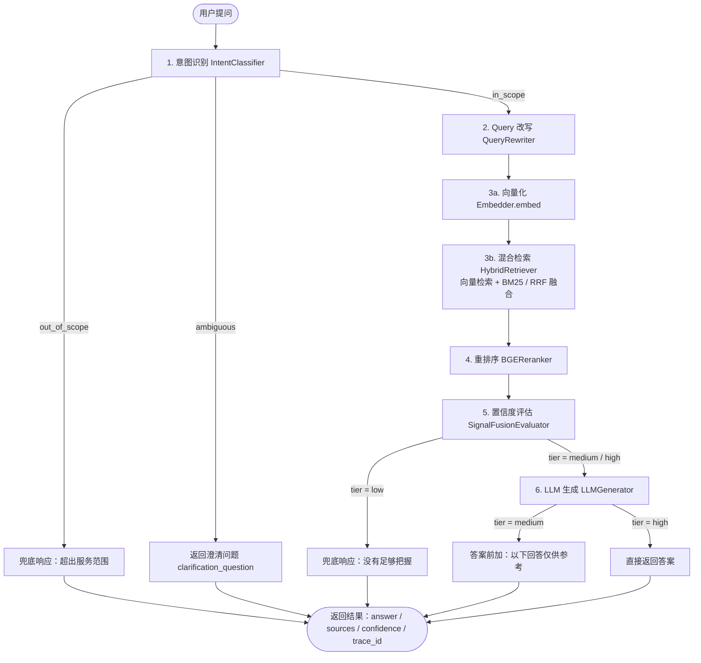
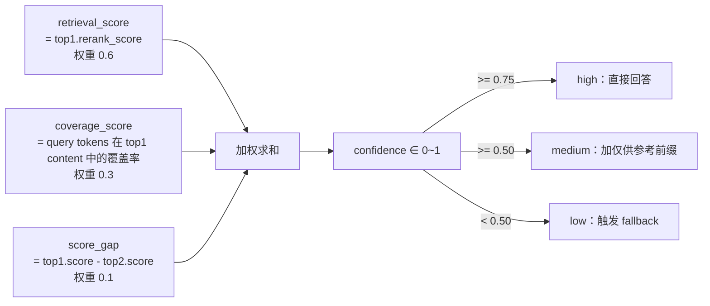
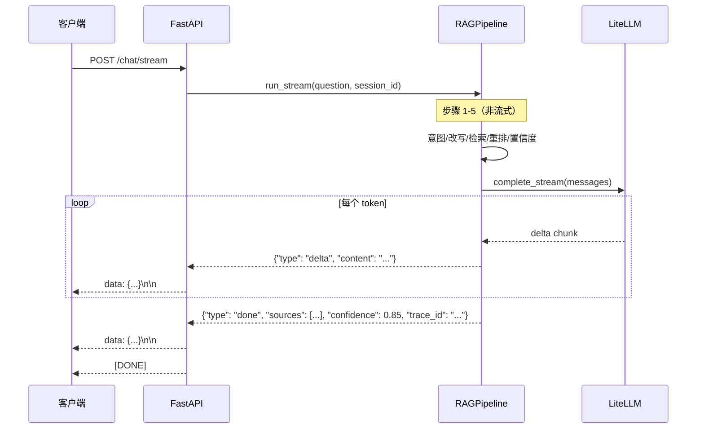

# RAG 查询流程

## 七步查询主流程



## 置信度三路信号



## SSE 流式输出时序



## RRF 融合算法

RRF（Reciprocal Rank Fusion）将向量检索和 BM25 结果合并：

```
rrf_score(doc) = Σ 1 / (k + rank_i)
```

- `k = 60`（平滑参数，减少顶部排名的影响）
- `rank_i` 为文档在第 i 路结果中的排名（从 0 开始）
- 同时出现在两路结果中的文档得到双重加分

示例（k=60）：

| 文档 | 向量排名 | BM25 排名 | RRF 分数 |
|------|---------|---------|---------|
| A | 0 | 0 | 1/60 + 1/60 ≈ 0.0333 |
| B | 1 | - | 1/61 ≈ 0.0164 |
| C | - | 1 | 1/61 ≈ 0.0164 |
