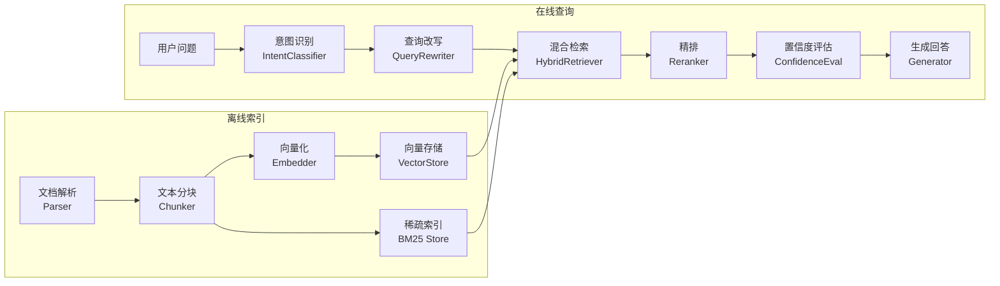

# RAG 选型速查（中文客服 · 本地部署优先）

> 适用场景：中文企业客服 RAG 系统新项目选型参考
> 硬约束：可本地部署、中文优化、开源优先
> 更新：2026-04-20

---

## 流程总览



---

## 各节点选型

### 离线索引

| 节点 | 推荐 | 理由 |
|------|------|------|
| **Parser** | python-docx (文本+表格) + PaddleOCR PP-OCRv5 (文档内图片 OCR) | 知识库推荐 DOCX 格式，解析简单可靠；python-docx 提取文本和表格，PaddleOCR PP-OCRv5 提取嵌入图片文字（PP-OCRv5 为 2025 年最新版，版面分析和识别精度较 v4 显著提升）；开发环境部署轻量版，生产部署完整版。DOC 文件建议先转 DOCX（LibreOffice CLI） |
| **Chunker** | RecursiveCharacterTextSplitter (500字/50重叠) | 中文按段落→句子递归切分，简单稳定；语义分块在中文场景提升有限且增加延迟 |
| **Embedder** | Qwen3-Embedding-0.6B | 2026 C-MTEB Retrieval 第一梯队；0.6B 参数 CPU 可跑；原生中英双语 |
| **VectorStore** | pgvector | 依托 PostgreSQL，运维统一、支持过滤+事务，中小规模（<百万）生产首选；百万级以上选 Milvus/Qdrant |
| **BM25 Store** | jieba 分词 + BM25S (原生持久化) | jieba 快且支持自定义词典（产品名/型号）；BM25S 比 rank_bm25 快 500x，原生支持 mmap 持久化无需 pickle；文档 >10万条时考虑切 Elasticsearch |

### 在线查询

| 节点 | 推荐 | 理由 |
|------|------|------|
| **IntentClassifier** | LLM few-shot 三分类 (in_scope / out_of_scope / ambiguous) | 小样本即可上线；比训练分类器维护成本低 |
| **QueryRewriter** | LLM prompt 改写（同义词展开+口语规范化） | 中文客服口语化严重，改写后召回率显著提升 |
| **HybridRetriever** | 向量 + BM25 → RRF 融合 | RRF 无需调权重即可融合两路；中文场景实测优于单路 |
| **Reranker** | Qwen3-Reranker-0.6B | CMTEB Reranking SOTA 级；0.6B CPU 可用；中文精排比 BGE 系列提升明显 |
| **ConfidenceEval** | rerank_score × 0.6 + coverage × 0.3 + score_gap × 0.1 | 多信号融合比单阈值稳定；无需训练，规则可解释 |
| **Generator** | DeepSeek-V3 (API) / Qwen3.5-9B (本地) | DeepSeek 性价比极高；纯本地选 Qwen3.5-9B（2026-02 发布，9B 参数打败 120B 级模型，Q4 量化可跑 16GB RAM，内置 thinking mode） |

---

## BM25 持久化方案

### 推荐：BM25S（原生持久化，比 rank_bm25 快 500x）

```python
import bm25s
import jieba

# 构建索引
corpus = [" ".join(jieba.cut(doc)) for doc in documents]
retriever = bm25s.BM25()
corpus_tokens = bm25s.tokenize(corpus, stopwords="zh")
retriever.index(corpus_tokens)

# 原生持久化到磁盘（mmap 格式，非 pickle，无安全风险）
retriever.save("bm25_index")

# 启动时加载（mmap 懒加载，大索引也毫秒级）
retriever = bm25s.BM25.load("bm25_index", mmap=True)

# 检索
query_tokens = bm25s.tokenize([" ".join(jieba.cut(query))], stopwords="zh")
results, scores = retriever.retrieve(query_tokens, k=10)
```

### 备选：rank_bm25 + pickle（更简单，小规模够用）

```python
import pickle
from rank_bm25 import BM25Okapi
import jieba

corpus = [list(jieba.cut(doc)) for doc in documents]
bm25 = BM25Okapi(corpus)

# pickle 持久化（⚠️ 仅加载可信来源文件，pickle.load 有任意代码执行风险）
with open("bm25_index.pkl", "wb") as f:
    pickle.dump({"bm25": bm25, "corpus": corpus}, f)
```

### 适用边界

| 方案 | 适用规模 | 优势 | 限制 |
|------|---------|------|------|
| BM25S | <50 万条 | 快 500x、mmap 持久化、无 pickle 安全风险 | 不支持增量更新 |
| rank_bm25 + pickle | <10 万条 | 极简、零学习成本 | 慢、pickle 安全风险、大文件加载慢 |
| Elasticsearch | >10 万条 | 实时增量、分布式、复杂过滤 | 运维重、需 Java |

---

## 选型演变说明

> 本系列调研经历了选型迭代，以下说明避免读者在交叉阅读时产生困惑。

| 变更 | 早期方案（03 文档） | 最终推荐（本文档） | 变更原因 |
|------|---------------------|---------------------|----------|
| Parser | MinerU（五层 Pipeline） | python-docx + PaddleOCR | 知识库统一为 DOCX 格式后，MinerU 的 PDF 版面分析能力不再是刚需；python-docx 解析更轻量可靠；MinerU 的 torch≤2.2.2 限制在 Intel Mac 上部署困难 |
| Chunker | SemanticChunker | RecursiveCharacterTextSplitter | 二者本质相同（递归按段落→句子切分），SemanticChunker 是项目自实现的名称，Recursive 是通用术语，参数一致（500 字/50 重叠） |

03 文档作为**架构参考**仍有价值（五层抽象、模态分类、开源方案对比），但具体选型以本文档为准。

---

## 备选方案速查

| 节点 | 备选 | 何时考虑 |
|------|------|---------|
| Parser | MinerU | PDF 图文混排复杂版面（公式+多栏）且开发机资源充足时 |
| Embedder | BGE-M3 (1.5B) | 需多语言或已有 BGE 生态时 |
| Reranker | BGE-Reranker-v2-m3 | 硬件资源极紧张或已有部署时 |
| VectorStore | Milvus / Qdrant | 文档量 >百万级需分布式，或需多租户隔离时；Chroma 适合本地原型验证 |
| BM25 Store | rank_bm25 + pickle | 极简场景、文档 <10万、不想引入新依赖时 |
| BM25 Store | Elasticsearch | 文档量 >50万，需实时增量更新+复杂过滤时 |
| Generator | Qwen3-8B / GLM-4-9B | 硬件不支持 Qwen3.5 时的本地退路 |

---

## 选型判据（通用）

1. **中文效果** — C-MTEB / CMTEB-R 排名为主要依据
2. **本地可跑** — 优先 ≤1B 参数模型（CPU 友好）；7B+ 需 GPU
3. **开源许可** — Apache 2.0 / MIT 优先，避免商用限制
4. **社区活跃** — GitHub star + 近 3 月 commit 频率
5. **集成成本** — HuggingFace Transformers 生态优先，避免私有框架锁定

---

## 选型决策树

```
新项目启动 → 确认文档格式
│
├─ 文档以 DOCX 为主 → python-docx + PaddleOCR（图片OCR）
├─ PDF 为主且版面复杂 → MinerU（需 GPU 或高内存开发机）
│
├─ 向量模型选型：有 GPU？
│   ├─ 否 → Qwen3-Embedding-0.6B（CPU，1.2GB）
│   └─ 是 → Qwen3-Embedding-4B/8B（按显存选）
│
├─ 精排模型选型：CPU only？
│   ├─ 是 → Qwen3-Reranker-0.6B（~300ms/query）
│   └─ 否 → Qwen3-Reranker-4B/8B
│
├─ 向量存储：文档规模？
│   ├─ <百万 → pgvector（统一 PostgreSQL 运维）
│   └─ >百万 → Milvus / Qdrant（分布式）
│
├─ 生成模型：可联网？
│   ├─ 是 → DeepSeek-V3 API（性价比最优）
│   └─ 否 → Qwen3.5-9B 本地（Q4 量化，16GB RAM 可跑）
│
└─ BM25 存储：文档量？
    ├─ <50万 → BM25S + jieba（原生 mmap 持久化）
    └─ >50万或需实时增量 → Elasticsearch
```

**决策核心逻辑**：先确定硬件约束（CPU/GPU、内存、联网），再按 C-MTEB 中文 benchmark 排名选同类最优。

---

## 引用

### 官方文档 & 模型

| 分类 | 资源 | 链接 |
|------|------|------|
| 文档解析 | PaddleOCR PP-OCRv5 文档 | https://paddlepaddle.github.io/PaddleOCR/main/en/version3.x/algorithm/PP-OCRv5/PP-OCRv5.html |
| 文档解析 | PaddleOCR GitHub | https://github.com/PaddlePaddle/PaddleOCR |
| 文档解析 | python-docx | https://python-docx.readthedocs.io/ |
| 文档解析 | MinerU GitHub | https://github.com/opendatalab/MinerU |
| 向量模型 | Qwen3-Embedding-0.6B | https://huggingface.co/Qwen/Qwen3-Embedding-0.6B |
| 向量模型 | Qwen3 Embedding 技术博客 | https://qwenlm.github.io/blog/qwen3-embedding/ |
| 向量模型 | BGE-M3 | https://huggingface.co/BAAI/bge-m3 |
| 精排模型 | Qwen3-Reranker-0.6B | https://huggingface.co/Qwen/Qwen3-Reranker-0.6B |
| 精排模型 | BGE-Reranker-v2-m3 | https://huggingface.co/BAAI/bge-reranker-v2-m3 |
| 生成模型 | Qwen3.5 GitHub | https://github.com/QwenLM/Qwen3.5 |
| 生成模型 | DeepSeek Platform | https://platform.deepseek.com/ |
| 向量存储 | pgvector | https://github.com/pgvector/pgvector |
| 向量存储 | Milvus | https://milvus.io/ |
| 向量存储 | Qdrant | https://qdrant.tech/ |
| BM25 | BM25S（推荐） | https://github.com/xhluca/bm25s |
| BM25 | rank_bm25（备选） | https://pypi.org/project/rank-bm25/ |
| BM25 | jieba 分词 | https://github.com/fxsjy/jieba |
| 分块 | LangChain RecursiveCharacterTextSplitter | https://python.langchain.com/docs/how_to/recursive_text_splitter/ |

### Benchmark & 评测

| 资源 | 用途 | 链接 |
|------|------|------|
| MTEB Leaderboard | Embedding/Reranker 综合排名 | https://huggingface.co/spaces/mteb/leaderboard |
| 2026 Embedding 模型对比 | 10 款模型实测 | https://milvus.io/blog/choose-embedding-model-rag-2026.md |
| Qwen3.5-9B 性能评测 | 与 GPT-OSS-120B 对比 | https://venturebeat.com/technology/alibabas-small-open-source-qwen3-5-9b-beats-openais-gpt-oss-120b-and-can-run |
| OmniDocBench CVPR 2025 | 文档解析工具排名 | 见 [01-parsing-tools-selection.md](./01-parsing-tools-selection.md) |

### 选型对比 & 最佳实践

| 节点 | 资源 | 说明 | 链接 |
|------|------|------|------|
| VectorStore | pgvector vs Qdrant vs Milvus (2026) | 延迟/扩展性/适用场景对比 | https://dev.to/linou518/choosing-the-foundation-for-your-rag-system-pgvector-vs-qdrant-vs-milvus-2026-4i5o |
| VectorStore | Vector Database Benchmark 2026 | 10 款向量库性能基准 | https://www.salttechno.ai/datasets/vector-database-performance-benchmark-2026/ |
| VectorStore | "不需要 Elasticsearch — BM25 已在 Postgres" | pgvector + pg_bm25 一体化方案 | https://www.tigerdata.com/blog/you-dont-need-elasticsearch-bm25-is-now-in-postgres |
| BM25 | BM25S — 比 rank_bm25 快 500x | Numpy+Scipy 实现，支持持久化 | https://github.com/xhluca/bm25s |
| BM25 | HuggingFace BM25S 技术博客 | 原理 + 基准对比 | https://huggingface.co/blog/xhluca/bm25s |
| HybridRetriever | RRF 混合检索详解 (2026) | RRF 原理 + k 参数调优 + 实测提升 15-30% | https://glaforge.dev/posts/2026/02/10/advanced-rag-understanding-reciprocal-rank-fusion-in-hybrid-search/ |
| HybridRetriever | Hybrid Search Done Right | BM25 + HNSW + RRF 工程实践 | https://ashutoshkumars1ngh.medium.com/hybrid-search-done-right-fixing-rag-retrieval-failures-using-bm25-hnsw-reciprocal-rank-fusion-a73596652d22 |
| HybridRetriever | RAG-Fusion 论文 | 多查询融合 + RRF 学术基础 | https://arxiv.org/abs/2402.03367 |
| Reranker | Qwen3 Embedding & Reranker 论文 | 架构设计 + 训练方法 + 全量 benchmark | https://arxiv.org/html/2506.05176v1 |
| IntentClassifier | LLM 意图分类最佳实践 | few-shot vs 微调 vs 混合方案对比 | https://labelyourdata.com/articles/machine-learning/intent-classification |
| IntentClassifier | Rasa — LLM 意图分类集成 | 工程落地方案 | https://legacy-docs-oss.rasa.com/docs/rasa/next/llms/llm-intent/ |
| Generator | Qwen3.5 完整指南 | benchmark + 本地部署 + 量化对比 | https://techie007.substack.com/p/qwen-35-the-complete-guide-benchmarks |
| 全链路 | The Ultimate RAG Blueprint 2025/2026 | 端到端架构 + 各节点选型建议 | https://langwatch.ai/blog/the-ultimate-rag-blueprint-everything-you-need-to-know-about-rag-in-2025-2026 |
| 全链路 | Production RAG Pipeline 2026 | 五层生产架构 + 评估标准 | https://www.roborhythms.com/how-to-build-production-rag-pipeline-2026/ |
| 全链路 | RAG 架构信任框架（arxiv） | 检索增强系统工程综述 | https://arxiv.org/html/2601.05264v1 |
| 全链路 | RAGFlow — 从 RAG 到 Context (2025 年终) | RAG 演进方向 + 中文场景实践 | https://ragflow.io/blog/rag-review-2025-from-rag-to-context |

